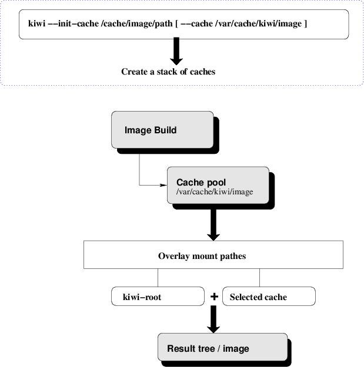

*************************************************************
第四章：镜像缓存
*************************************************************

镜像缓存介绍
===============================

一个镜像用例的创建需要相当一段时间，并且同样的软件通常会多次安装。为了加快这一过程，kiwi 可以创建和重用所谓的镜像缓存。kiwi 中的一个镜像缓存是由缓存镜像描述创建的部分根目录树。

    
在使用缓存之前首先需要进行创建。缓存可以从一个标准的 kiwi 镜像描述进行创建，包括引导镜像描述。这也就意味着，您可以直接使用模板或者 *引导镜像描述* 来创建缓存。但是基于缓存这一目标来创建镜像描述将显得更为明智。例如，这些描述可以代表一些列的模式。缓存特殊性越少，可重用度越高。

如果系统中存在 kiwi 可以选择的最佳匹配的缓存，然后将会挂载该缓存，所有的写时操作都将会重定向到新的根系统。通过这种方式，缓存自身将不会由任何改动，可以同步用于其他构建进程。这样，构建过程将不会从零开始构建，而是从一个几乎完整的根目录树开始。只有那些缺失的部分才需要进行安装，根据缓存所覆盖的内容多少，可以相应的加速构建过程。

镜像缓存使用示例
===============================

假设，我们希望基于 SLES 12 JeOS 构建一些 *vmx* 类型的镜像。为创建系统的镜像缓存和引导镜像，需要执行下述步骤：

1. 构建引导镜像(initrd)缓存：

   .. code-block:: shell

      kiwi --init-cache /usr/share/kiwi/image/vmxboot/suse-SLES12

2. 构建 JeOS 镜像缓存：

   .. code-block:: shell

      kiwi --init-cache /usr/share/kiwi/image/suse-SLE12-JeOS/
      
默认情况下，这些缓存将会在 :file:`/var/cache/kiwi-images` 目录创建。为了使用这些缓存来执行构建，需要执行下面的命令：

.. code-block:: shell    

   kiwi --build suse-SLE12-JeOS -d /tmp/myimage --type vmx \
     --cache /var/cache/kiwi-images  
     
与不使用缓存创建过程相比，这一命令将会使创建过程加快很多。特别需要了解的是，基于缓存的构建过程创建的根目录树仅包含与所使用的缓存差异的部分。因此，任何时候，您需要在其他地方使用该镜像，您需要确保缓存存在并且可以被系统访问。

