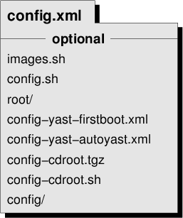

*************************************************************
第五章：KIWI 镜像描述
*************************************************************

为了能够使用 KIWI 创建镜像，需要创建一个镜像描述文件。镜像描述是一个目录，包含至少一个名称为 :file:`config.xml` 或者 :file:`*.kiwi` 的文件。在 :file:` /usr/share/doc/packages/kiwi/examples` 目录下包含一些示例，可以作为很好的入手练习参考。

config.xml 文件
===============================

image 元素
-------------------------------

description 元素
-------------------------------

profiles 元素
-------------------------------

preferences 元素
-------------------------------

users 元素
-------------------------------

drivers 元素
-------------------------------

repository 元素
-------------------------------

packages 元素
-------------------------------

使用模板
*******************************

架构限制
*******************************

在启动镜像中引入包
*******************************

数据无法同包一样引入
*******************************
